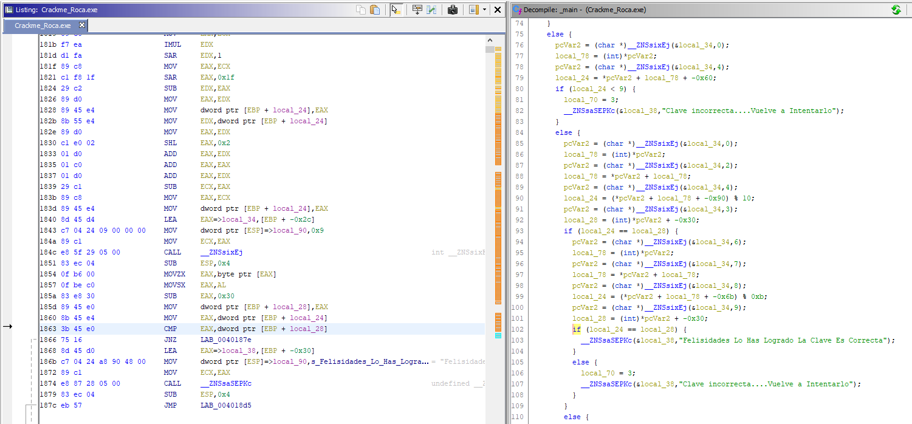
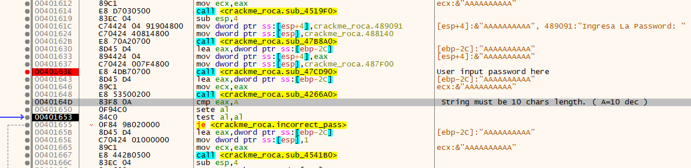
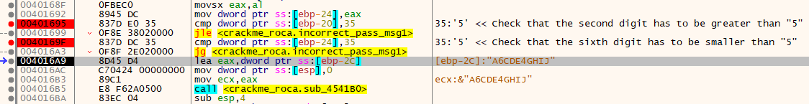
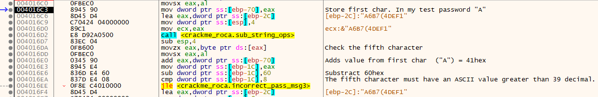
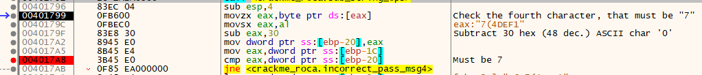
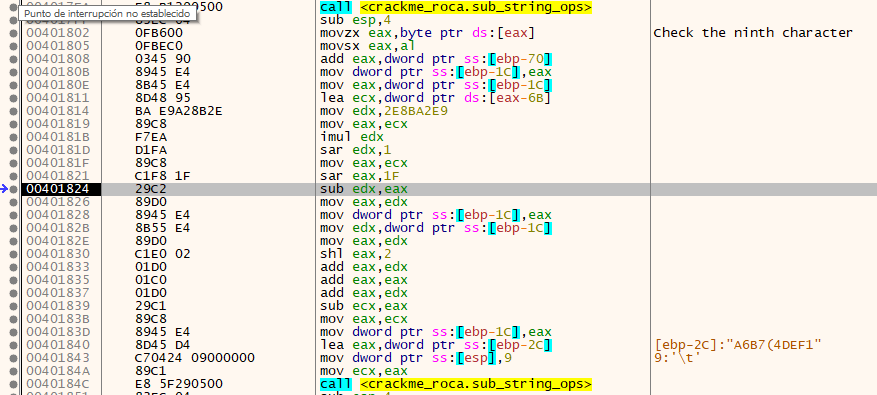
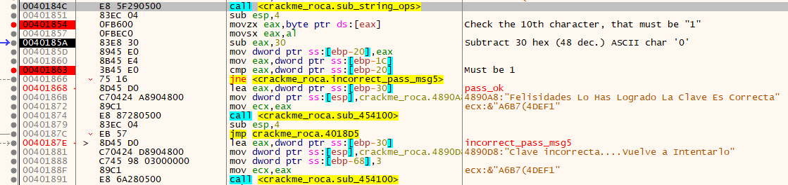
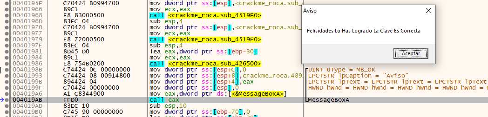
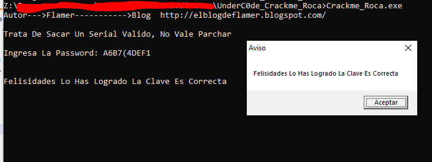

# [Crackme_Roca by Flamer](https://underc0de.org/foro/ingenieria-inversa/crackme_roca-by-flamer/)

## Crackme writeup by [@310hkc41b](https://twitter.com/310hkc41b) https://twitter.com/310hkc41b
#### Date: 31/mar/2020 

You can download **CrackMe_Roca** from this [link](Crackme_Roca.zip). 

The first step, as always, analyze it with different antivirus engines to see what they tell us. Surely it is not malicious, but we can see that the techniques used in the CrackMe make the alarms of some antivirus.

 

To analyze this file I have used **Ghidra** and **x64dbg**, simply by trying both tools and seeing the differences. It is good to contrast and train in both dynamic and static.

## Ghidra analysis

After doing a first analysis we see that the code simply asks us for a serial number (or password) and that to check if it is correct it does a series of operations and calculations, probably because the serial number is encrypted in memory. And finally make a single comparison to find out if the serial number is correct. It is at this point where we will focus and observe in the next section what value is obtained in the comparison.

 

## x64dbg analysis

Initially we check that the password must be exactly 10 characters long, as this is the first check that is made.

Once the password length has been verified. To continue verifying the different verifications I start from a specific pattern to be able to identify the password in memory, for example: **"ABCDEFGHIJ"**.

The next point checks the second and sixth characters that have to be greater than "5" in the first case, and less than "5" in the second case.

Now it does another operation to verify the fifth character, but it is based on the value of the first character, so the value varies depending on the first character.

In this case, the fourth character has to be a 7.

There are operations with other characters, which I have not found relevant, because finally they **do not make any comparison**, so we can omit them.

The last check is for the tenth character that has to be a "1", and leads us to the final message of having found a correct key.

### Password conditions

So, in summary we have the following conditions for each character or digit.

	Length 10 chars.
	
	Char	Condition
	=====	==================================================================
	  1     = "A" for our test, this char affects the condition of the fifth.
      2     > 5 : valid 6 7 8 9 : ; etc
	  3     no condition
	  4     = 7 
	  5     > ' (39 dec) : valid ( ) * +
	  6     < 5: valid 4 3 2 1 0 / . etc 
	  7     no condition
	  8     no condition
	  9     no condition
	 10     = 1

Therefore, our test password (or serial) would be the following: **A6B7(4DEF1**

# That's all folks!

