# [BinaryNewbie Small Keygenme](https://crackmes.one/crackme/5e83f7f433c5d4439bb2e059)
#### https://crackmes.one/crackme/5e83f7f433c5d4439bb2e059

## Crackme writeup by [@H0l3Bl4ck](https://twitter.com/H0l3Bl4ck) https://twitter.com/H0l3Bl4ck
#### crackmes.one user [b1h0](https://crackmes.one/user/b1h0) https://crackmes.one/user/b1h0
#### Date: 22/abr/2020 

You can download **Small Keygenme** from this [link](little-crackme). 

The author informs us of this within a **README**:

	Hello buddy !!!!
	An easy keygenme challenge.
	Read the [SPECS]
	Have fun.
	Binary Newbie.

	[SPECS]
	- Assembled with nasm;
	- Stripped;
	- 64-bits elf file, tested in ubuntu 18.04 LTS;
	- Any kind of patch is forbidden;
	- Obfuscation: 0;
	- anti-debug/anti-disassembly tricks: 0;
	- Goals - Understand how it works, write a keygen, and finally, write a solution;
	- Target - Beginners.

	PS: If you have any doubt or any question about the challenge, feel free to call me in Discord or send an email to: vitor.oliveira.24.24@gmail.com

 
## Ghidra's static analysis 

We have here an executable in **ELF** format compiled for **64 bits**.

") 

We see that it uses the **SYSCALL** and to identify the functions we can start from [this website: **https://filippo.io/linux-syscall-table/**](https://filippo.io/linux-syscall-table/) that offers us the reference for **64 bits**.

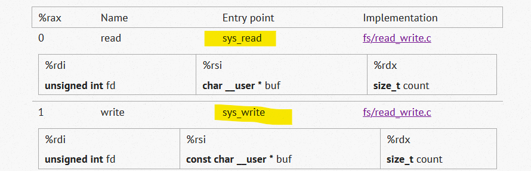 

Analyzing the entry point, we identify the first function that prints the texts on the screen and rename it to clarify the code.

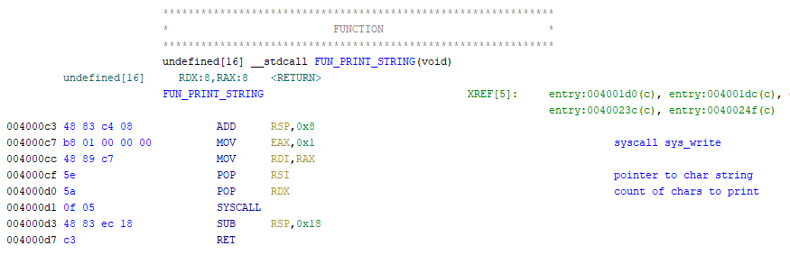 

Next, we identify the function expected to enter the serial number.

 

We continue to identify small pieces of code and functions and give them names. In this case, the exit to the system.

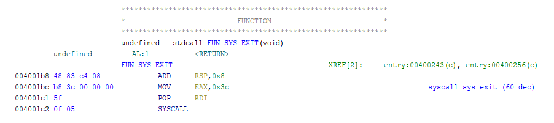 

So, after having renamed some functions and commenting on some operations, we have the **entry point** (which is the **main function** of the program) as follows, in the absence of finishing analyzing some functions.

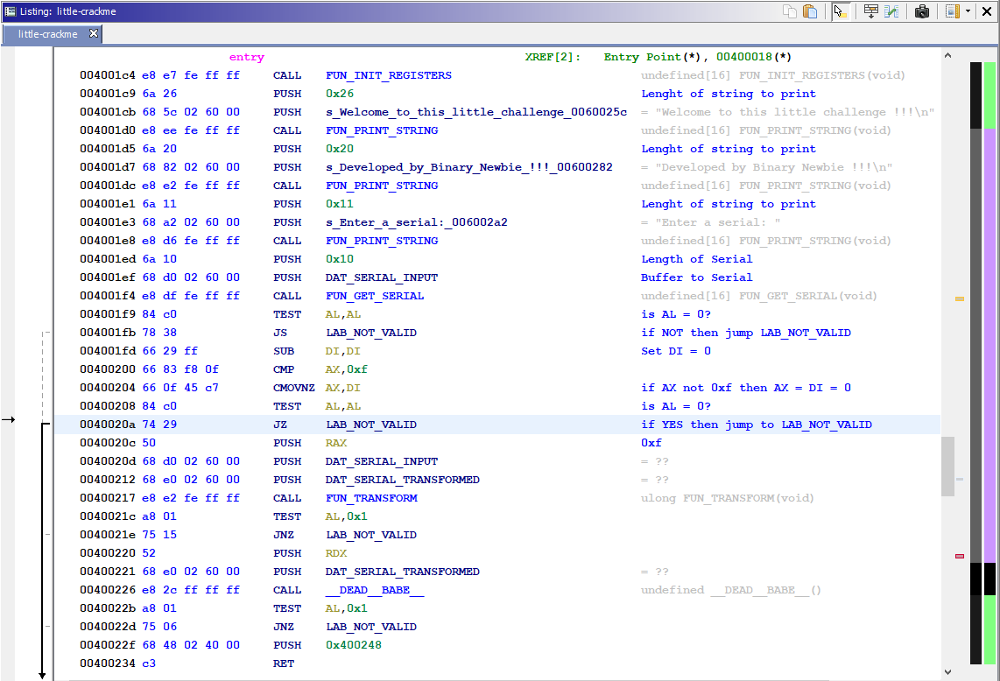 

I will now focus on 2 functions that are what have to give us the solution.

The first one I will call **FUN_TRANSFORM**, which without knowing exactly what it does yet, seems to carry out some kind of calculation or transformation of the string.

I will call the second function **__DEAD__BABE__** for a specific operation it does.

And finally, note a curious thing, and that is that the code has a jump to the **LAB_NOT_VALID** tag that shows us the message that the serial is not valid, but there is **no jump** to the message that indicates that the serial is correct . I will discover the secret a little later if you have not seen it at this time.

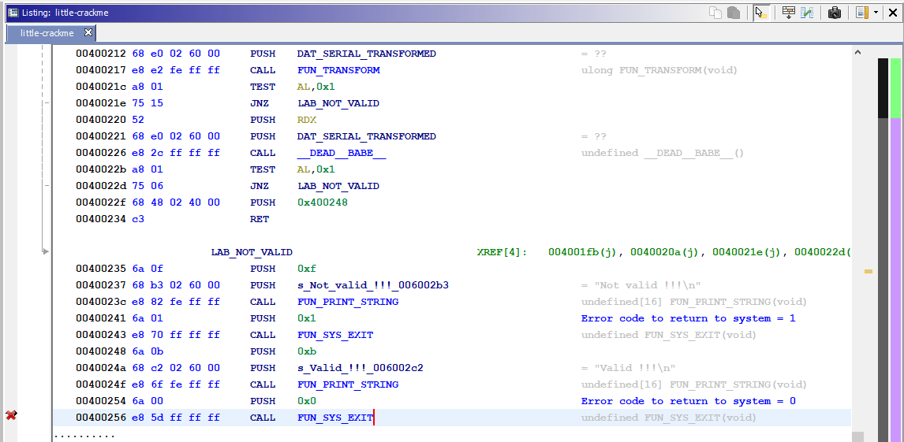 

After analyzing the **FUN_TRANSFORM** function, we see that what it actually does is check that all the digits entered in the serial are valid values for a hexadecimal number, and it stores its value in decimal (one per byte) in a new array.

So we will change the name of the function and call it **FUN_HEXA_CONVERT**.

I leave here the complete function in two screenshots, and with your comments, which I think are more than enough to understand what it does.

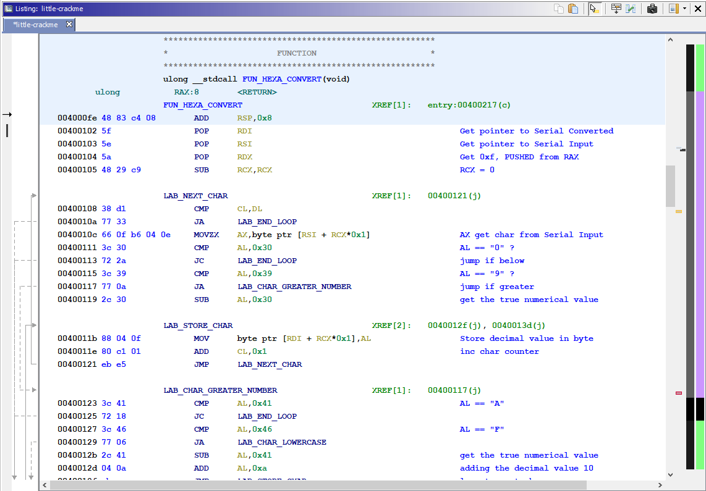

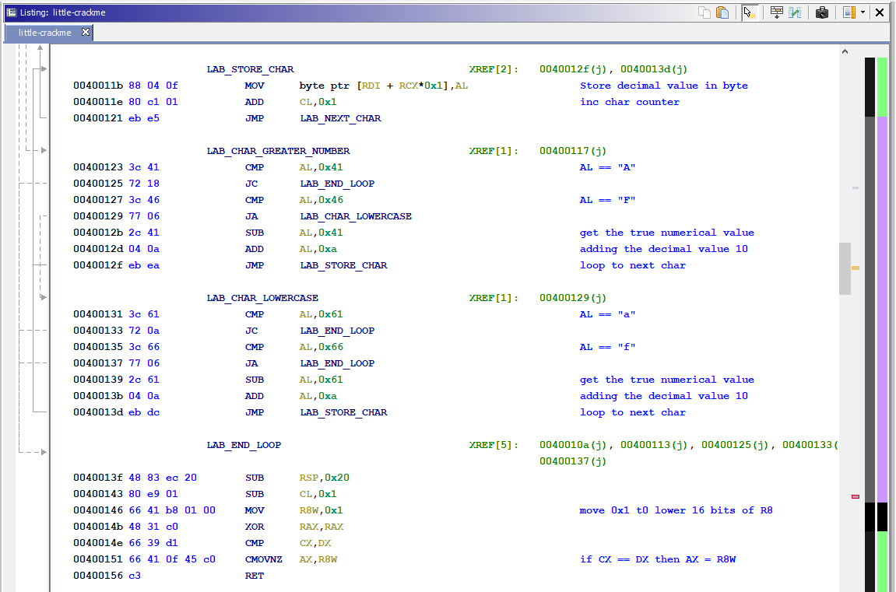

We will now analyze the function that we have named as **__DEAD__BABE__** which will give us the solution to crackme.

We have here a function that goes through all the values and performs some operations to check certain values. Depending on whether the value is **odd** or **even**, it will do different operations. If all the values pass the validation, the serial number will be good.

Knowing that the valid digits are hexadecimal values we have that we can only test the values **0,1,2,3,4,5,6,7,8,9, A, B, C, D, E, F**.

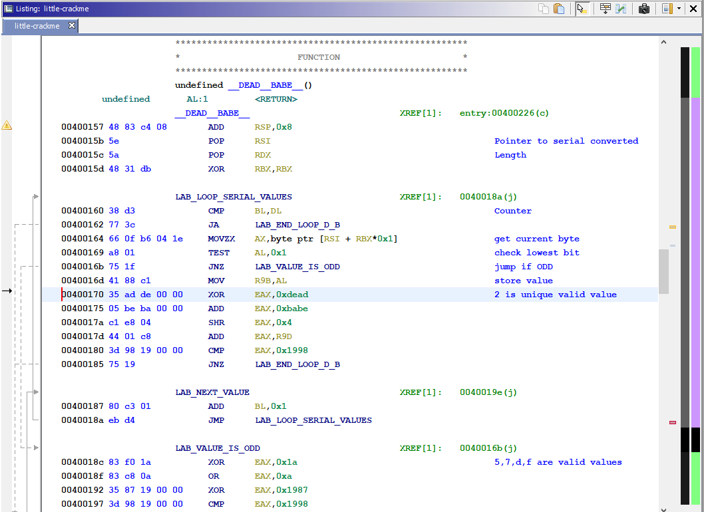

As the calculation is different for odd and even we separate them and do the manual test with the operations. Let's see an example with the number 2 that is even:

We see that the original value is saved in the **R9B** register, subsequently an **XOR** is made with the value **0xdead**, the result is added the value **0xbabe**, they are moved 4 bits to the right and the previously stored value is added. If the result of the operation is **0x1998** then the value is valid.

    0040016d 41 88 c1           MOV      R9B,AL                     ; R9B = 2
    00400170 35 ad de 00 00     XOR      EAX,0xdead                 ; 2 XOR 0xdead = 0xdeaf
    00400175 05 be ba 00 00     ADD      EAX,0xbabe                 ; EAX = EAX + 0xbabe = 0x1996d				
    0040017a c1 e8 04           SHR      EAX,0x4                    ; 0x1996D shr 4 = 0x1996
    0040017d 44 01 c8           ADD      EAX,R9D                    ; EAX = 0x1996 + 2 = 0x1998
    00400180 3d 98 19 00 00     CMP      EAX,0x1998
    00400185 75 19              JNZ      LAB_END_LOOP_D_B

As we can see **2 meets the condition**. If we do the same operations with the rest of the even numbers, none of them comply, therefore, in this section we can determine that the only valid number is 2.

We are going to do the same with the odd numbers.

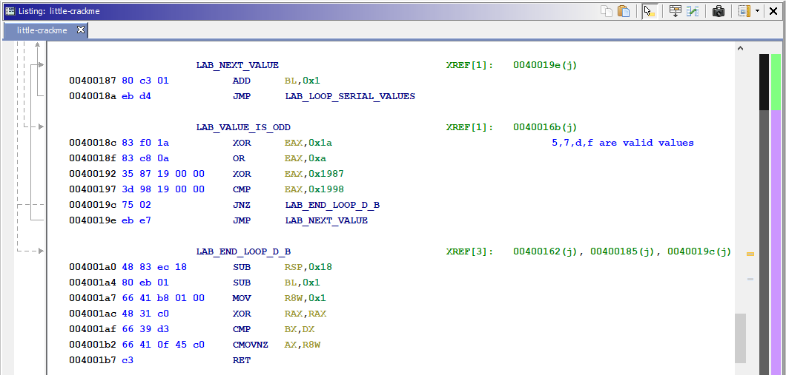

                         LAB_VALUE_IS_ODD                            
    0040018c 83 f0 1a           XOR      EAX,0x1a                   ; EAX = 5 XOR 0x1a = 0x1f
    0040018f 83 c8 0a           OR       EAX,0xa                    ; 0x1f OR 0xa = 0x1f
    00400192 35 87 19 00 00     XOR      EAX,0x1987                 ; 0x1f XOR 0x1987 = 0x1998
    00400197 3d 98 19 00 00     CMP      EAX,0x1998
    0040019c 75 02              JNZ      LAB_END_LOOP_D_B
    0040019e eb e7              JMP      LAB_NEXT_VALUE

Here the operations are different. An **XOR** of the value is made with **0x1a**, followed by an **OR** with **0xa** and again an **XOR** with **0x1997**. If the result is **0x1998** then that value (digit) is valid. As there are not many, you just have to do the operations with this and we obtain that the valid values are: **5,7,d**, and **f**.

Thus we can conclude that any **16 digit** serial number containing the characters **2, 5, 7, d or f** will be valid.

Let's check it with 3 different random combinations to see what happens ...

- **252575d2f777f55d**

- **7df522ff575dd2df**

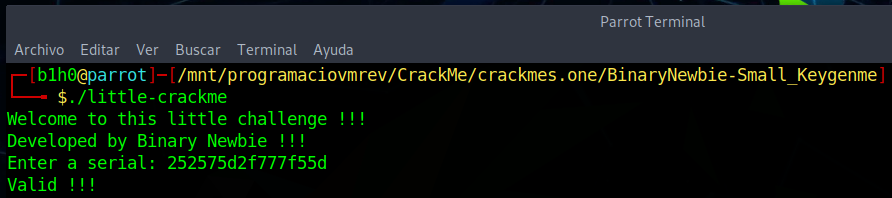

- **d5f7f52ff55dd275**

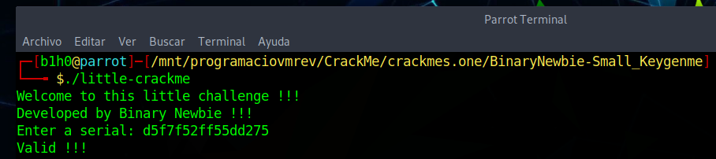

## Serial generator  

We are going to create a simple serial number generator. Each time we invoke it it will give us a random number that matches the specifications.

Keep in mind that the letters can be uppercase or lowercase, and have the same value, but we can mix them to make it appear that the serial number is different, although in reality it is the same.

[**Download source code**](keygen/little-crackme-keygen.c)

	/*
	 * little-crackme-keygen.c
	 * Serial generator for BinaryNewbie's Small Keygenme
	 *                      https://crackmes.one/crackme/5e83f7f433c5d4439bb2e059
	 * Author: Gabriel Marti
	 * Twitter: @H0l3Bl4ck
	 */
	#include <stdio.h>
	#include <stdlib.h>
	#include <string.h>
	#include <time.h>

	char *serialgen(unsigned int length, char *charset) {    
		char *serial_string = NULL;
		int sz = strlen(charset);
		if (length) {
			srand(time(NULL));  
			serial_string = malloc(sizeof(char) * (length+1));
			if (serial_string) {            
				for (int n = 0; n < length; n++) {            
					int key = rand() % sz;
					serial_string[n] = charset[key];
				}
				serial_string[length] = '\0';
			}
		}
		return serial_string;
	}

	int main(int argc, char **argv) {
		char *valid_digits = "257dfDF";      
		printf("Serial generator for BinaryNewbie's Small Keygenme\n");
		printf("Serial: %s\n", serialgen(16, valid_digits));
		return 0;
	}

We're going to try it

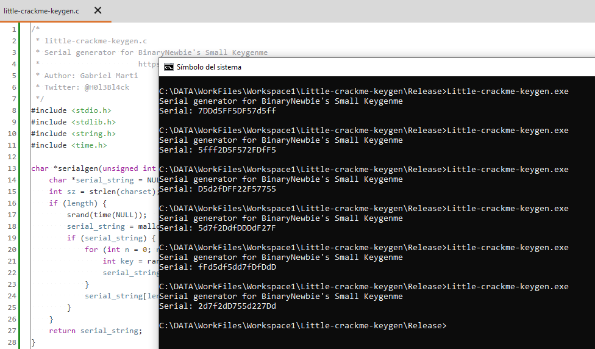

You can **download** the [keygen Windows binary from here](keygen/Little-crackme-keygen.exe)

# That's all folks!

