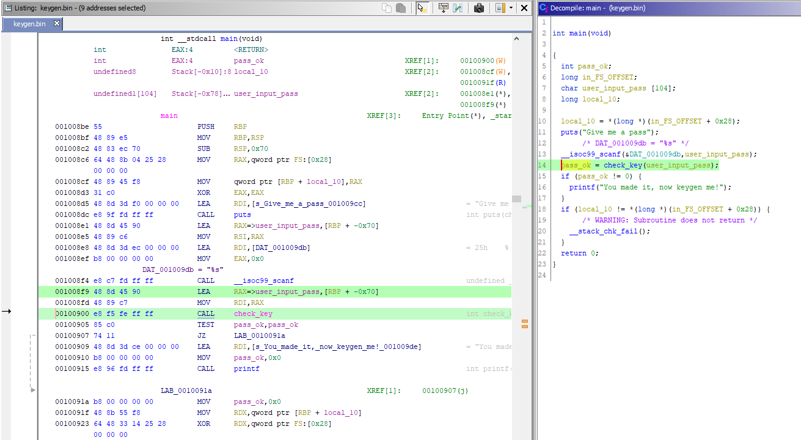
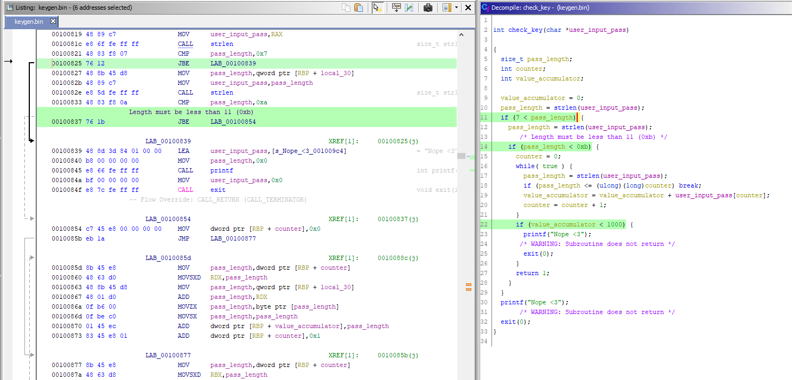
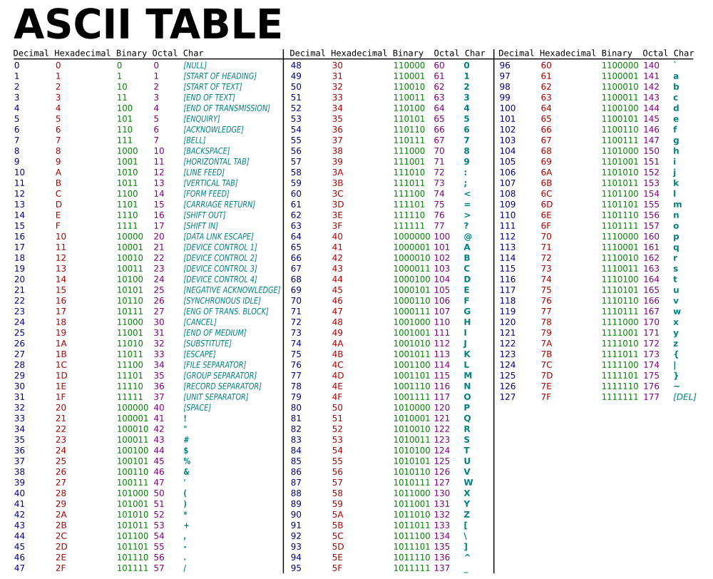
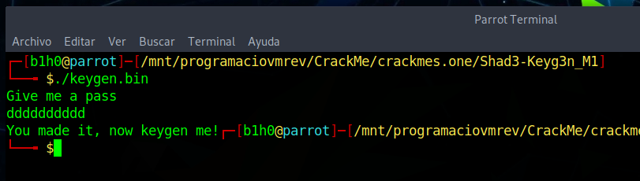
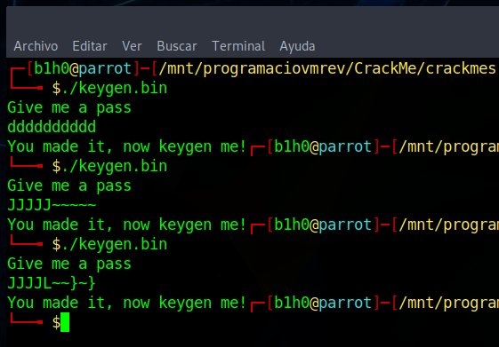

# [Shad3-Keyg3n_M1#1](https://crackmes.one/crackme/5e66aea233c5d4439bb2dde8)
#### https://crackmes.one/crackme/5e66aea233c5d4439bb2dde8

## Crackme writeup by [@310hkc41b](https://twitter.com/310hkc41b) https://twitter.com/310hkc41b
#### crackmes.one user [b1h0](https://crackmes.one/user/b1h0) https://crackmes.one/user/b1h0
#### Date: 10/abr/2020 

We have here a crackme that asks it to break and generate a keygen.

It claims to be cross-platform, but the binary is only in **ELF** format for Linux.

Let's start with the static analysis with Ghidra ...

## Ghidra's static analysis 

After carrying out the initial analysis, looking for the **main()** function and substituting some variable names to make the code clearer and easier to understand, we have the following function.

 

We are asked to enter a password that will be stored in a variable that we will call **"user_input_pass"**, and then the **check_key()** function is called to check if the password is correct.

The function returns a value other than 0 if we have found the correct password.

 

Here we can observe 3 conditions (or 2 if we reduce the first two if in one with and condition):

1) The password length must be **greater than 7 and less than 11**. That is, it can be 8, 9 or 10 characters.
2) The sum of the **ASCII** values of all the digits of the password must be **equal to or greater than 1000**.

We also start from the condition, not written, that the password has easily visible or printable characters. So we could consider valid all characters from 33 (! After the blank space) to 126 (~).

 

Thus, based on these premises, we can quickly calculate a valid password. For example, any character with an ASCII value equal to or greater than 100 (lowercase letter d) and repeated 10 times, will give us a valid password.

Example: **dddddddddd**

Let's check it ...

 

Based on this, we can easily make a valid password generator.

## Password generator 

We are not going to complicate much. You just have to do a function that adds the ASCII values of a string and prints the generated strings that return a value of 1000 or higher.

For this we generate the sequence of digits character by character within the range that we need and we make 10 nested loops, one for each character, and we calculate if the password is valid for the combinations of 8, 9 and 10 characters.

Since the sum has to be 1000, for 10 characters the minimum character would be the letter 'd', but since we can get to the 126th character, we can subtract 26 positions and start from the 74th character that is the 'J' to find the maximum of valid passwords.

Here is the keygen [source code](src_and_passgen/Shad3-keygen-M1.c), and you can [download it Windows binary executable from this link](src_and_passgen/Shad3-keygen-M1.exe):

	/*
	 * Shad3-keygen-M1.c
	 * Password generator for Shad3-Keyg3n-M1
	 * Author: Gabriel Marti
	 * Twitter: @H0l3Bl4ck
	 */
	#include <stdio.h>
	#include <string.h>

	/* returns ASCII value sum of pass if length are between 8 and 10 */
	int key_value(char *current_pass) {
		int pass_length;
		int counter;
		int value_accumulator;

		value_accumulator = 0;
		pass_length = strlen(current_pass);
		if (pass_length > 7 && pass_length < 11 ) {
		  counter = 0;
		  while(counter < pass_length) {
			value_accumulator += current_pass[counter];
			counter++;
		  }
		}
		return value_accumulator;
	}

	/* Print password if it's valid */
	void show_valid_pass( char *pass, int good_pass ) {
		int result;
		result = key_value(pass);
		if ( result >= good_pass) {
			printf("Valid Password %s value( %d )\n", pass, result);
		}
	}

	int main(int argc, char **argv)
	{
		int good_pass = 1000;
		char c1, c2, c3, c4, c5, c6, c7, c8, c9, c10, first, last;
		char pass[11];
		 
		pass[10] = '\0';
		printf("Searching possible valid passwords ...\n\n");
		
		first = 'J';
		last = '~';
		   
		for (c1 = first; c1 <= last; c1++) {
			for (c2 = first; c2 <= last; c2++) {
				for (c3 = first; c3 <= last; c3++) {
					for (c4 = first; c4 <= last; c4++) {
						for (c5 = first; c5 <= last; c5++) {
							for (c6 = first; c6 <= last; c6++) {
								for (c7 = first; c7 <= last; c7++) {
									for (c8 = first; c8 <= last; c8++) {
										pass[0] = c1;
										pass[1] = c2;
										pass[2] = c3;
										pass[3] = c4;
										pass[4] = c5;
										pass[5] = c6;
										pass[6] = c7;
										pass[7] = c8;
										pass[8] = '\0';
										show_valid_pass(pass, good_pass);
										for (c9 = first; c9 <= last; c9++) {
											pass[8] = c9;
											pass[9] = '\0';
											show_valid_pass(pass, good_pass);
											for (c10 = first; c10 <= last; c10++) {
												pass[9] = c10;
												pass[10] = '\0';
												show_valid_pass(pass, good_pass);
											}
										}
									}
								}
							}
						}
					}
				}
			}
		}
		return 0;
	}

Obviously, as there are many combinations, the result can take a long time.

Here we have a part of the passwords that it begins to generate.

") 

And here is the result of trying a couple of these.

 

# That's all folks!

