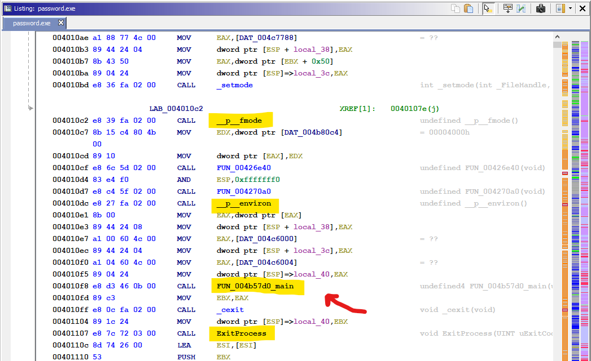
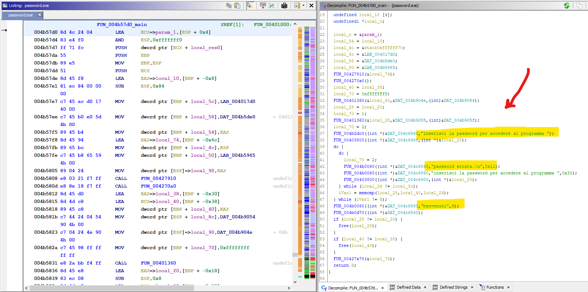
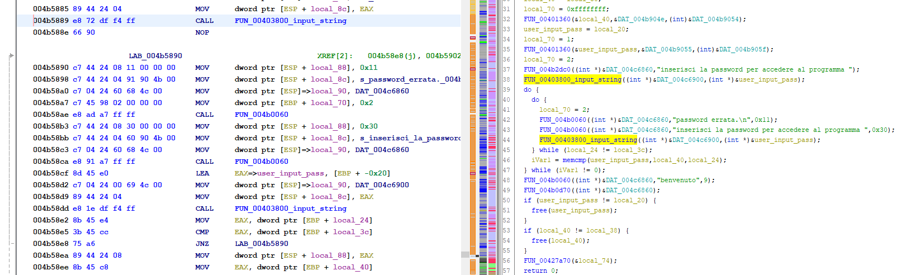
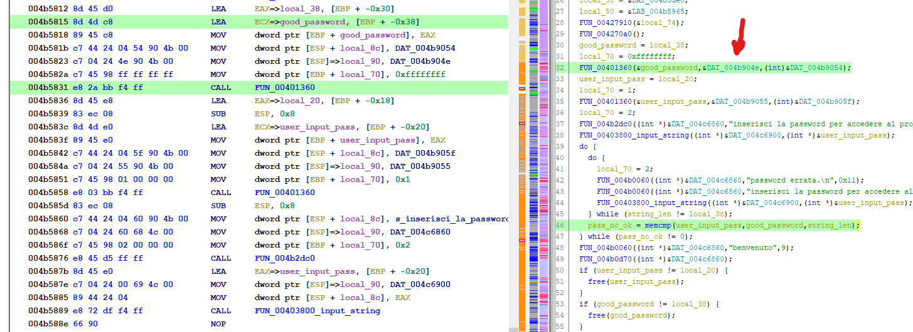
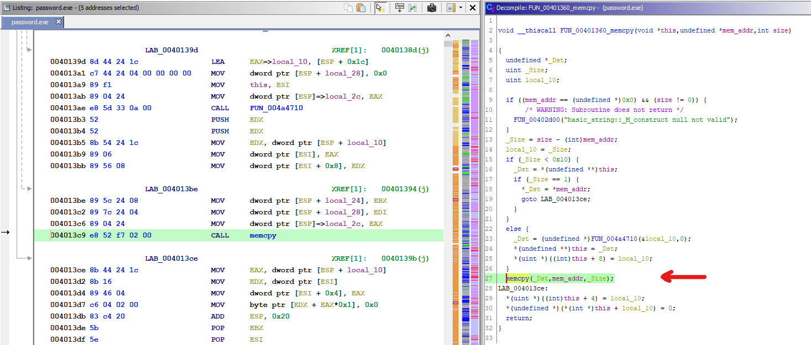
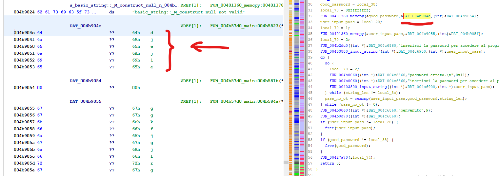
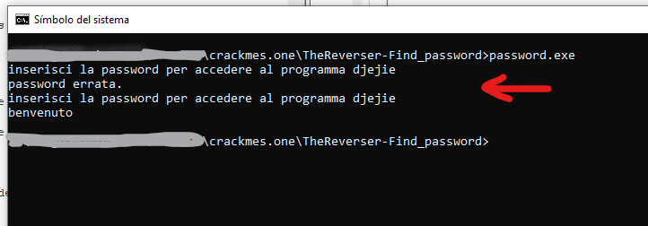

# [TheReverser-Find_password](https://crackmes.one/crackme/5e9f4e8033c5d476117463a9)
#### https://crackmes.one/crackme/5e9f4e8033c5d476117463a9

## Crackme writeup by [@310hkc41b](https://twitter.com/310hkc41b) https://twitter.com/310hkc41b
#### crackmes.one user [b1h0](https://crackmes.one/user/b1h0) https://crackmes.one/user/b1h0
#### Date: 05/may/2020 

You can download **TheReverser-Find_password** from this [link](password.exe). 

 
## Ghidra's static analysis 

We have a **Windows executable**, which has no reference to the **main()** function. We look for the entry point and we follow the different calls where we find a part of the code where it makes calls to the CRT mode and then to the environment variables, and then below there is a call to the exit to the system.

It is in this area, before the exit to the system, where the **main()** function of the program is located, so we rename it as the first starting point.

 

Entering already inside the **main()** we can quickly identify, and helping ourselves with the decompiler, the area where it shows the messages and asks us for the password. We already have specific points to look at and some variables to rename.

If we focus on the decompiled code we see that there is a function that repeats 2 times. One before starting a loop and one inside a loop. If we test the program we can verify that this is the data entry function where the password is requested.

The funny thing is that after asking for the password the first time it does not do any checking at all. It goes directly into the loop, so only the password we enter second is valid. The first time, even if it's a good one, it will always show us an error message and will ask us for the password again.

We see that the check is done with 2 nested loops. The first one verifies that the length of the string is the expected one, therefore we can already identify which variables refer to the length of the password. Then the **memcmp()** function is called which compares two strings in memory and returns an integer indicating s and one string is greater than another or they are the same. If the returned result is 0, it means that the strings are the same.

So, let's change a few more variable names.

We can now see a variable that we will call **"good_password"** in which it is assumed that we have the password that is the correct one. A little further up, before entering the loop, a function is called with reference to this variable. Let's see what it does.

This function copies the contents of one memory area over another. A copy of literal strings. So let's see what is in that memory area pointed to by **&DAT_004b904e**.

Here we can see that the text there is **"djejie"**. Can this be the password? Surely. Let's check it ...

Here we can see how the first time it tells us that the password is incorrect, but in the next attempt it is accepted. This is probably done to mislead the user, or perhaps it is a programmer error. In any case we already have the solution.

# That's all folks!

