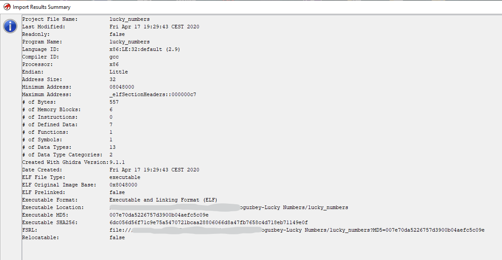
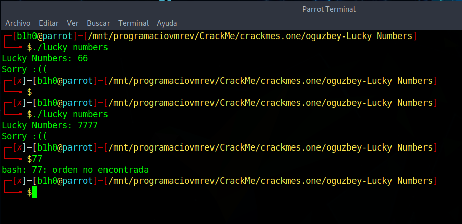
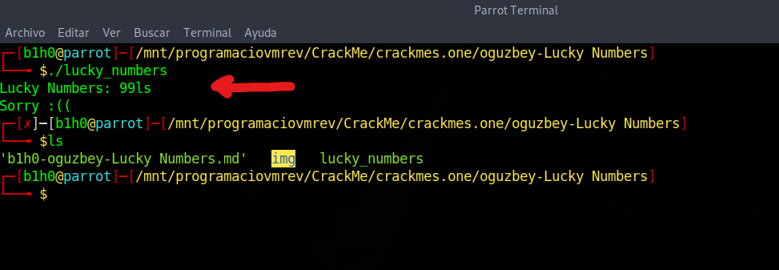
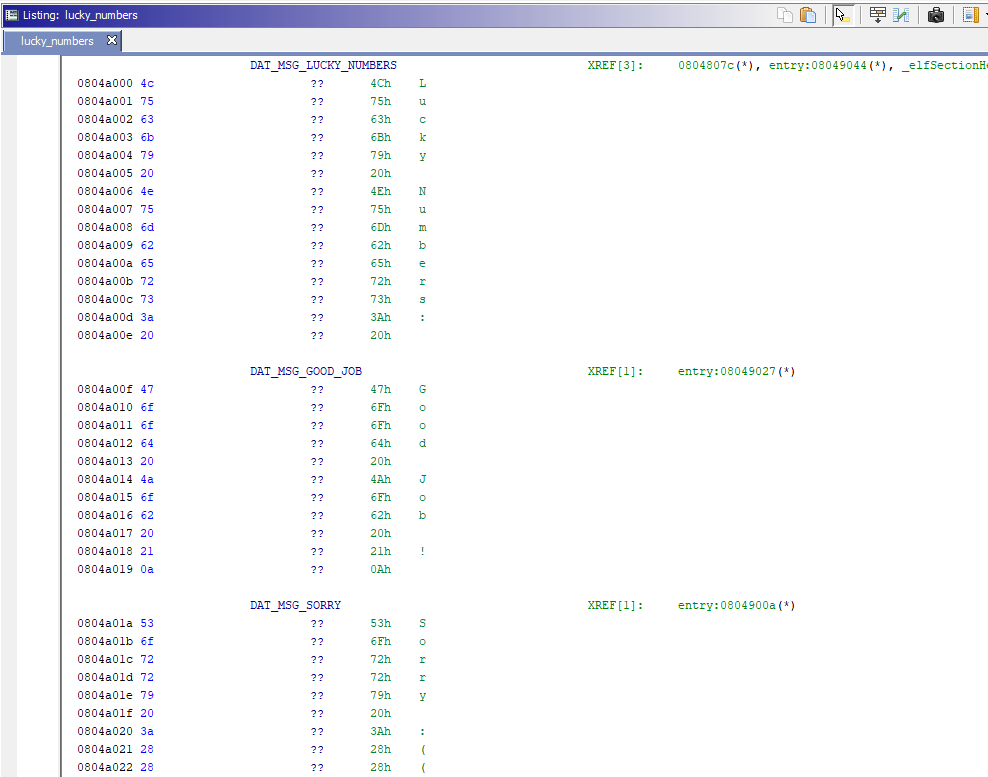
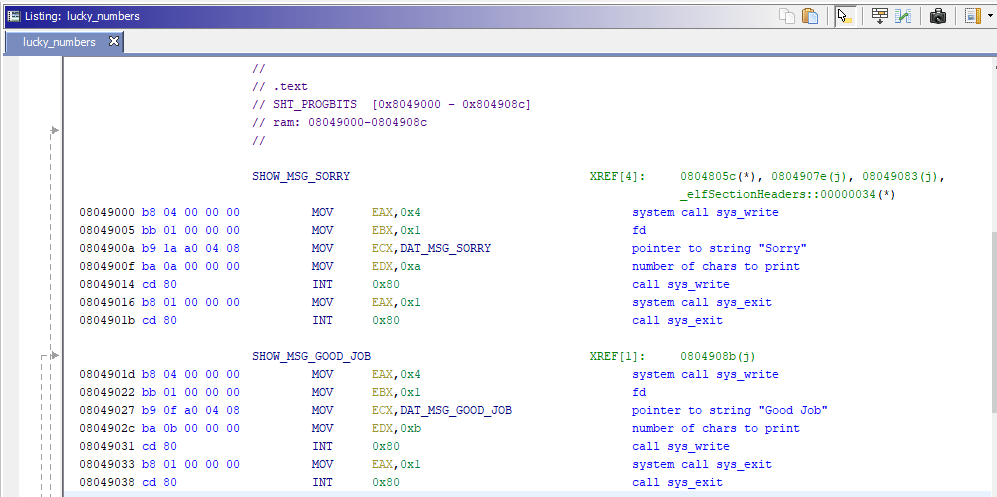

# [oguzbey Lucky Numbers](https://crackmes.one/crackme/5e567e1d33c5d4439bb2dca0)
#### https://crackmes.one/crackme/5e567e1d33c5d4439bb2dca0

## Crackme writeup by [@H0l3Bl4ck](https://twitter.com/H0l3Bl4ck) https://twitter.com/H0l3Bl4ck
#### crackmes.one user [b1h0](https://crackmes.one/user/b1h0) https://crackmes.one/user/b1h0
#### Date: 18/abr/2020 

You can download **lucky_numbers** from this [link](lucky_numbers). 

We have here an executable in **ELF** format (Linux).

 

Shows us only the message **"Lucky Numbers"** and expects us to enter, apparently a number.

 

But something very curious happens. If the number has more than two digits, the remaining digits are tried to be executed in console after the program ends.

So we already have a first clue, and that is that the number has to be a value between 0 and 99.

And we have a side effect that could lead to the execution of a command.

Take note of the following screenshot.

 

Let's do the static analysis ...

## Ghidra's static analysis 

We start by analyzing the data section and find the following texts. Assigning labels for better identification.

 

Here we have the code part where the success or error messages are shown, where it is verified that it makes calls to the **Linux Syscalls**.

You can find a reference to these calls at the following link: [https://syscalls.kernelgrok.com/](https://syscalls.kernelgrok.com/)

 

Next, we have the main function, which begins at the entry point, and is the one that we have to analyze more deeply to understand how the number entered by the user is verified.

 

After entering the numerical value, which we already know **must be 2 digits**, it makes the corresponding conversion of each digit to its numerical value subtracting the **ASCII value 0x30** (character code "0").

Then we can see that it adds the first digit and the second and leaves its value in the **AL** register, subsequently making a correction with **DAA** so that the value that remains in the register is the result of the sum in **BCD format**.

Since the comparison with AL is with **0x16**, it means that the sum of the two digits must be **16 dec**, so the valid combinations would be 79, 97 or 88.

Then we see that the result of the second digit adds 0x30 again and compares with the value **0x38**, therefore it indicates that the second digit must be an **"8"**.

So the crackme solution is **88**.

Let's see if I'm right ...

 

# That's all folks!
