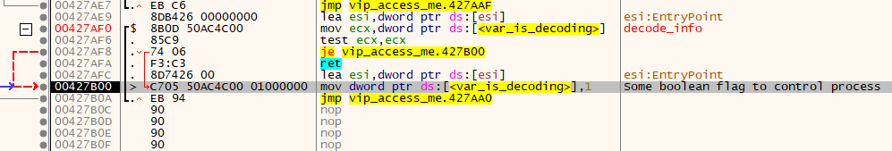
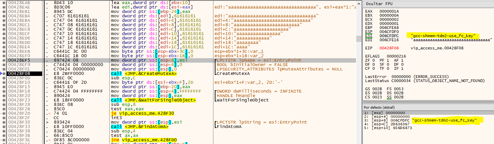
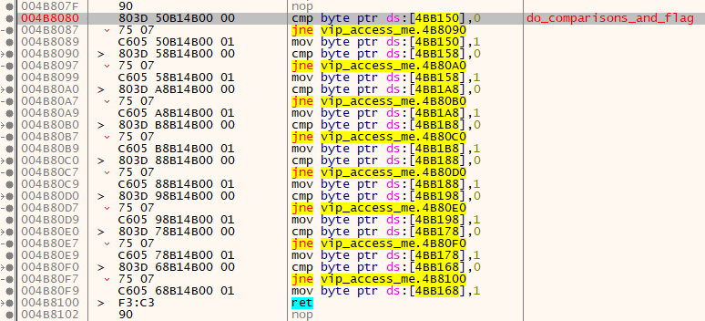
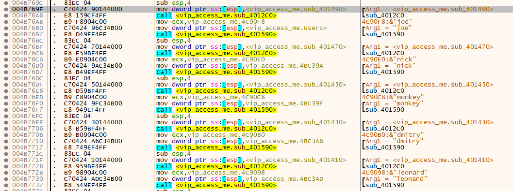
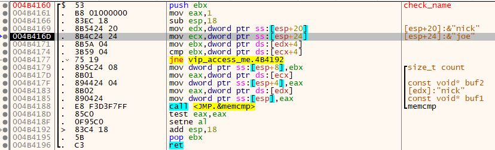
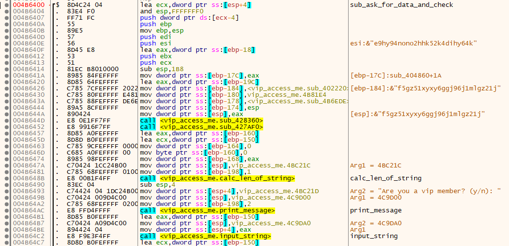
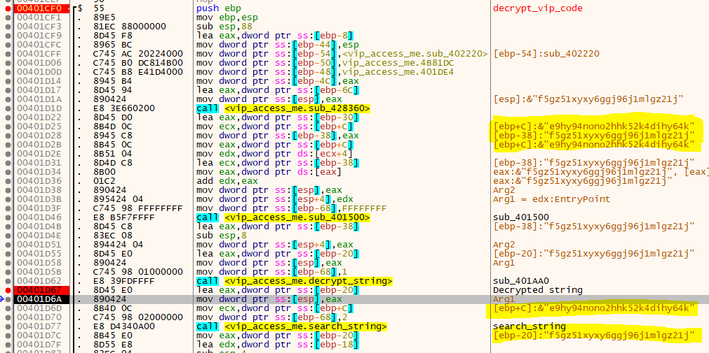
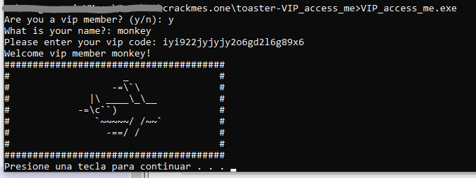

# [toaster VIP_access_me](https://crackmes.one/crackme/5d0251c133c5d41c6d56e0c3)
#### https://crackmes.one/crackme/5d0251c133c5d41c6d56e0c3

## Crackme writeup by [@310hkc41b](https://twitter.com/310hkc41b) https://twitter.com/310hkc41b
#### crackmes.one user [b1h0](https://crackmes.one/user/b1h0) https://crackmes.one/user/b1h0
#### Date: 04/oct/2019 

To analyze this file I have used two methods: *static*, with **Ghidra**, and *dynamic* with **x64dbg**. (In Ghidra there are few notes. I am still learning).

#### Ghidra : Some useful notes

- After analyzing the binary, if we look at the strings in memory it is easy to identify what the user names would be, and probably encrypted vip codes.

*User names and encrypted passwords strings*

#### x64dbg : Some useful notes

- Main function is located at **00401000**

- At the beginning of this subroutine, it sets a value of 1 over a memory position, where at the end of the process it returns to 0, so it is apparently a Boolean control variable.

*Some type of control variable*
 

- At address **006CFE16** fills char **'a'** 64 times.
- Create a Mutex using string **"gcc-shmem-tdm2-use_fc_key"**.  
  This information is probably not relevant to find the VIP CODES, but I liked to put it. :sweat_smile: 

*Mutex creation* 

- At address **006CFDFC**, after the creation of Mutex, to the string used are added all the 'a' that had been created previously, but changing some lowercase 'a' to uppercase 'A'. Remaining the resulting string as follows: **"gcc-shmem-tdm2-use_fc_key-aaaaaaaaaAAaaAaaAaaaAaAaAAAAaaaa"**
 
- At address **004B8080** It makes a comparison of different memory positions and activates a flag (Boolean variable) for each memory position that has the value 1 activated that is also supposedly Boolean. The same at address **004B7FF0** & **004B7F20** & **004B7E50**
(other information that is not useful to solve)

*A sub that do memory comparisons and activate boolean flag*

- From the address **004B769F** are the functions that the user names reveal to us.
The names are: **joe**, **nick**, **monkey**, **dmitry** and **leonard**.

*Username strings*
  

- At **004B4160** there is the function that compares the string with the username.

*Compare Username*

 
- From address **004B7750** some operations with strings like:
 **e9hy94nono2hhk52k4dihy64k**, **abc123l6encrypted99fsnzsf**. They are the **"VIP codes"** that are encrypted.

*These resulting encrypted strings, are the VIP Codes*

- At address **004B6400** Ask for the data

- And now, the function that really matters to us. The one that decrypts the VIP Code. It is in the address **00401CF0**.
Just put a breakpoint at address **00401D67** and check that it is what is loaded into the **EAX** register that contains the memory address where the **VIP CODE** is.

Here are the list of names, ecoded and decoded vip codes are:

	 name         encrypted vip code            decrypted vip code
	===============================================================================
	 joe          e9hy94nono2hhk52k4dihy64k     f5gz51xyxy6ggj96j1mlgz21j   ok 
	 nick         abc123l6encrypted99fsnzsf     bac468i2fxctzvrfm55eqx0qe   ???
	 monkey       lol566kokoko602hm6i2h35n2     iyi922jyjyjy2o6gd2l6g89x6   ok
	 dmitry       jokes843toohard567asm7b73     kyjfq318ryygbtm927bqd7a78   ???
	 leonard      five2156sizx67o1hn7m891h2     elwf6492ql0n27y4gx7d354g6   ???
	===============================================================================

But something curious happens. Only work VIP Codes for *joe* and *monkey* users. The other VIP Codes that are generated when tested do not seem correct as the following message is displayed:
**"Please enter lower english letters and numbers only!"**

*Result of the two VIP Codes that work.*

*VIP Codes that do not work: "Please enter lower english letters and numbers only!"*

That's all folks!!!

