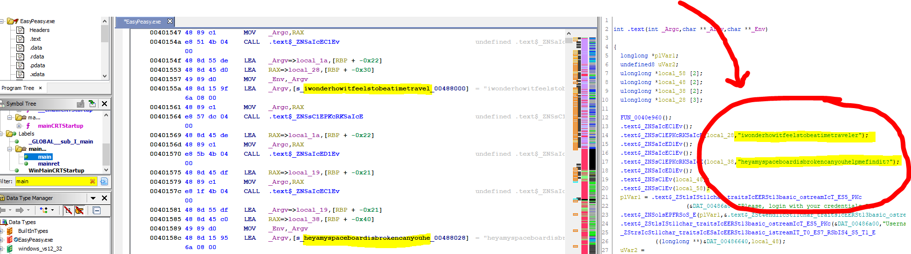
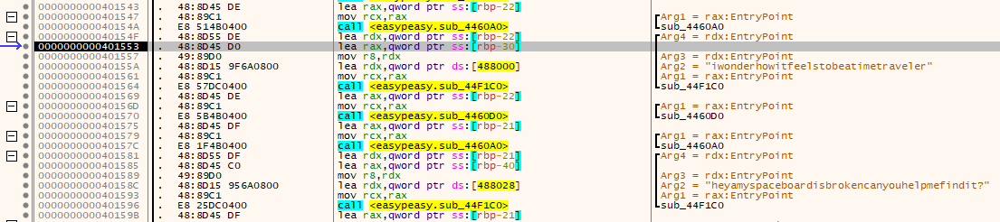
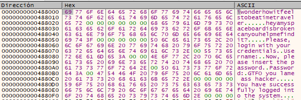
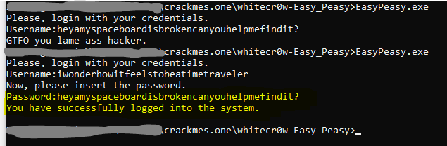

# [whitecr0w Easy Peasy](https://crackmes.one/crackme/5d295dde33c5d410dc4d0d05)
#### https://crackmes.one/crackme/5d295dde33c5d410dc4d0d05

## Crackme writeup by [@H0l3Bl4ck](https://twitter.com/H0l3Bl4ck) https://twitter.com/H0l3Bl4ck
#### crackmes.one user [b1h0](https://crackmes.one/user/b1h0) https://crackmes.one/user/b1h0
#### Date: 05/oct/2019 

To analyze this file I have used **Ghidra** and **x64dbg**, simply by trying both tools and seeing the differences. It is good to contrast and train in both dynamic and static.

#### Ghidra - notes

1. Load executable and Analyze.
2. Search in **Symbol Tree** left dialog the text **"main"**.
3. In **Listing** you can see at address **0040155a** the username that is: **"iwonderhowitfeelstobeatimetravel"**
4. Next, at address **0040158c** the password is revealed to us: **heyamyspaceboardisbrokencanyouhelpmefindit?**
5. In the code decompilation window you can also see clearly.
6. I think we don't need anything else.

 
 

#### x64dbg - notes

- Its a 64bits Windows exe

- Strings with the username and password are also revealed quickly and without problems from **00401553**:
	**"iwonderhowitfeelstobeatimetraveler"**, **"heyamyspaceboardisbrokencanyouhelpmefindit?"**.

 

- The string in **.rdata** section at **0000000000488000**

 

- What else?

 

