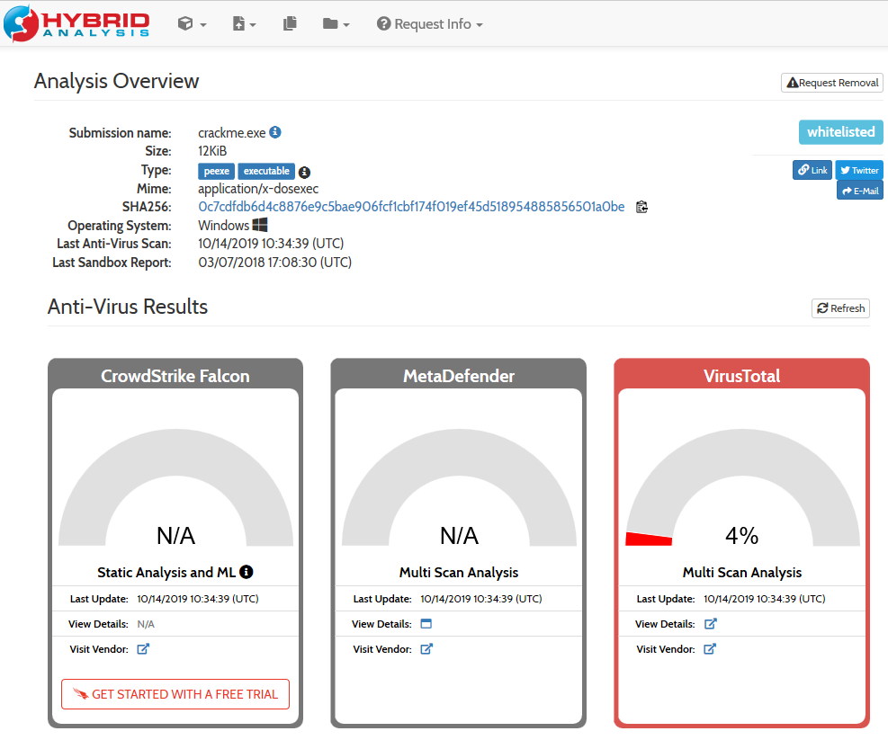
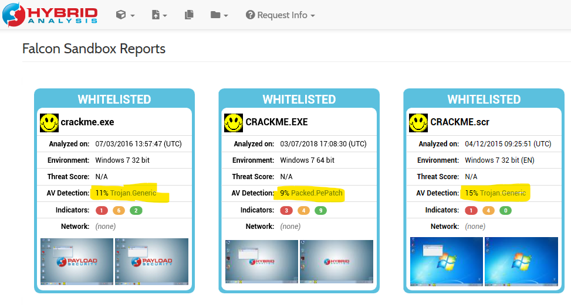
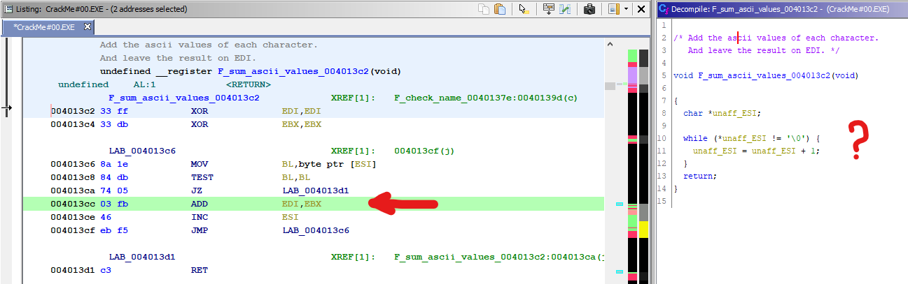
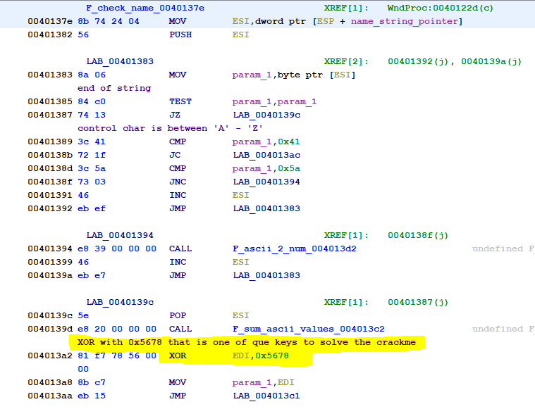
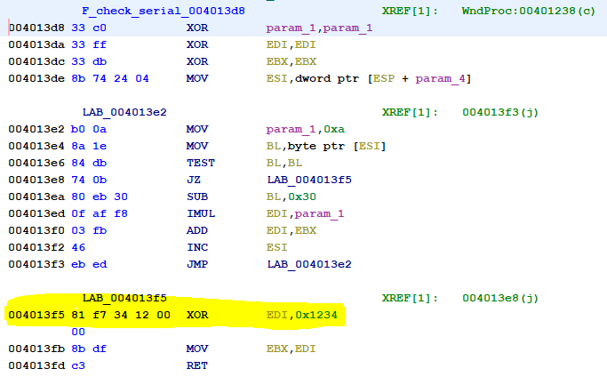
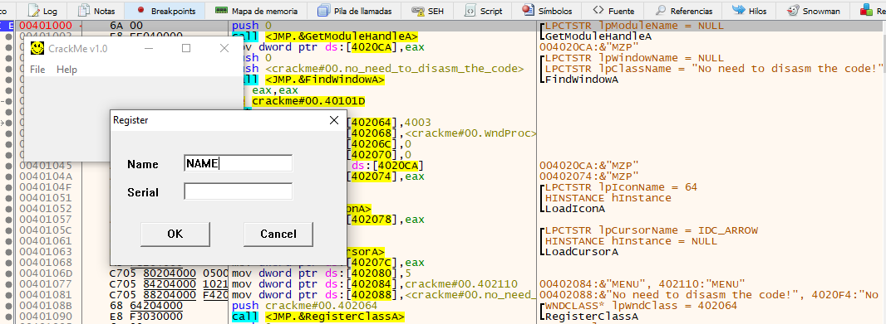
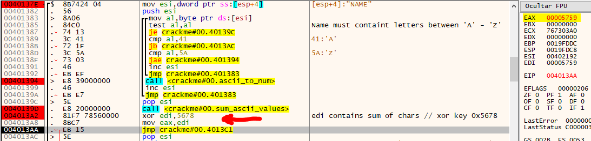
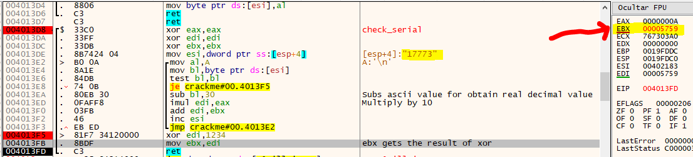
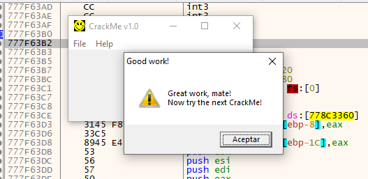

# [CrackMe#00](#no_source_available)
#### I do not have a source site for downloading this crackme because I do not remember how it came to me. Probably in one of these many searches I did online.

## Crackme by [b1h0](https://crackmes.one/user/b1h0) https://crackmes.one/user/b1h0
#### Date: 03/nov/2019 

You can download it from this [link](CrackMe#00-pass-1337.7z) . The password is **1337**.

**Attention!!!!** Maybe it's a false positive. But it should be alert. **Hybrid Analysis** whitelisted this file, but can be a Trojan.

**Post-note:** It is a false positive. The file is safe. But you should always be alert and analyze the binaries with different sources and never try them on a machine in production. Always use a Virtual Machine.

[Hybrid Analysis Overview]()
 

[Hybrid Analysis Sandbox]()
 

To analyze this file I have used **Ghidra** and **x64dbg**, simply by trying both tools and seeing the differences. It is good to contrast and train in both dynamic and static.

 
#### Ghidra - notes

Ghidra is not very effective decompiling the code when it comes to a binary created directly in assembler and not a language like C. In this case you can see how part of the code that accumulates the ascii value of the characters in a string has been skipped. Probably for using the EDI registry since it is not normal.

 

At **0040137e** we have a function that checks the name after entering it, which actually makes a sum of the **ASCII** values of each character and then makes an **XOR** with the value **0x5678** which is one of the keys to solve this crackme.

 

From address **004013d8** we have the function that I call **check_serial**, which checks the serial number, converting the string value to numerical and making an **XOR** with the value **0x1234**, which is the second key to solve this crackme.

 

After analyzing different parts of the code I prefer to go directly to the analysis with **x64dbg**.

#### x64dbg - notes

The form field asks for **NAME** and **SERIAL**. We will first focus on the NAME where we will put the text "NAME" and see what we get. In the SERIAL for the moment we will put "12345" although the value does not matter.

 

We arrive at the point where we are interested, where after entering the name, we see that the **XOR** performs and we obtain the resulting value that is **0x5759** that is in the **EAX** register.

 

As we know that compares the results of the two XOR operations, and in the case of the number it makes an XOR with **0x1234** (and it is a symmetric function), if we perform an XOR with the value obtained from the NAME chain that is **0x5759** we get the value **0x456D** that passed to the decimal value corresponds to the number **17773**, which is the SERIAL number that would correspond to the name "NAME".

And here is the result.

Thus, it is about obtaining the value of the XOR from the name chain, and to this value apply an XOR with the value 0x1234, which will give us the serial number that we must enter.

For example, for the name **"BLACK"** we obtain the value **0x5725** to which if we apply the XOR with **0x1234** it gives us the value **0x4511** that corresponds to the decimal number **17681** which is the serial number.

# That's all folks!

