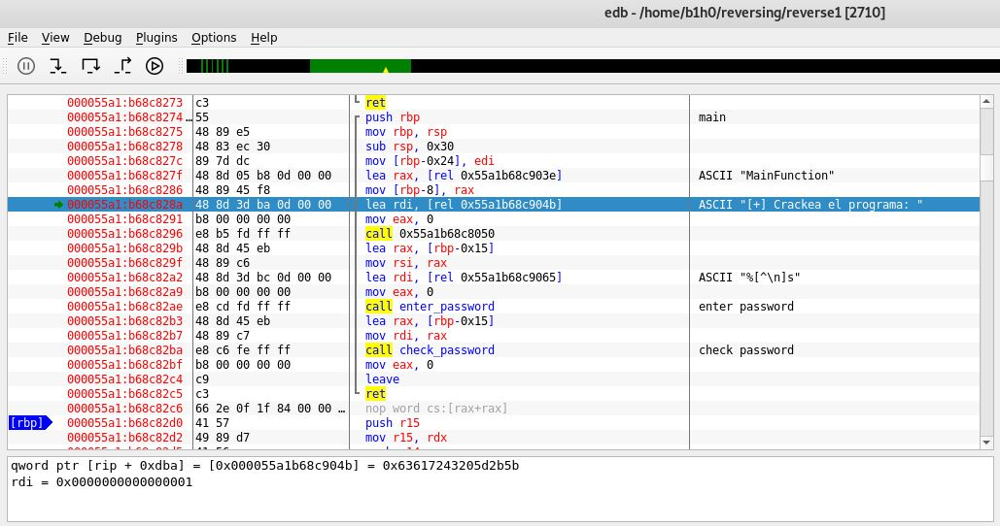
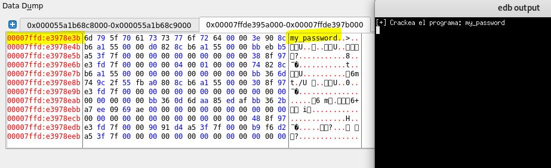
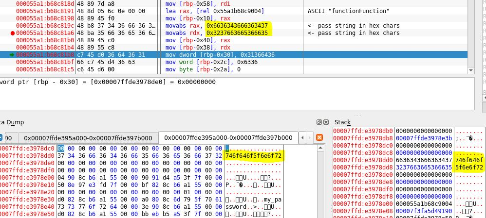
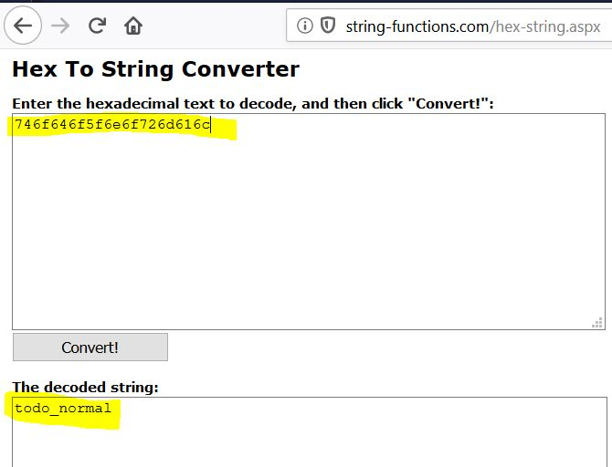
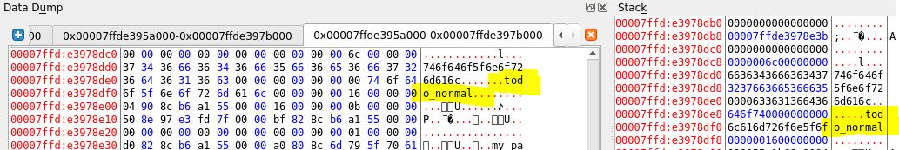
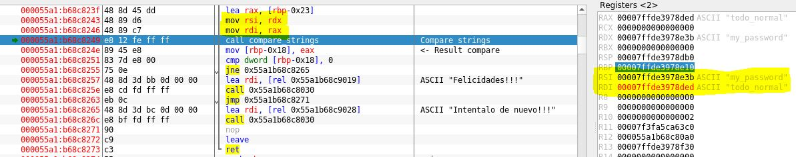
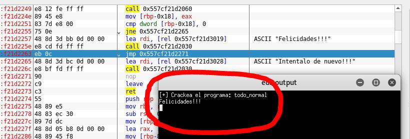

# [gc's reverse1]()
### no source provided

## Crackme writeup by [@H0l3Bl4ck](https://twitter.com/H0l3Bl4ck) https://twitter.com/H0l3Bl4ck

This binary was sent to me by a friend. He was also sent another person and the source is unknown. In this same folder you can download the binary.

#### Date: 03/oct/2019 

You can download **reverse1** from this [link](reverse1). 

To solve this crackme I used my **Kali Linux VM** and the **edb debugger** that were more than enough to solve it.

- After locating the main function we can see where the text string is loaded that asks us to enter the text and two specific call calls, one that asks for the text string and another that checks the password we have entered.

- We are going to focus on the second call, because the others are not relevant.

- We enter a text that we can identify well and locate ourselves to know where it is stored in memory. This will help us later to see where the comparison is made (if necessary).

- In the subroutine we have called "check_password" we can see how at the beginning of this a movement of fixed values is made to memory positions. Later we can verify how these values correspond to the representation in ASCII of a hexadecimal string.

- And here we have the proof of that. Using a simple hexadecimal to ascii converter we can see that the text string **"todo_normal"** appears.

- Below is the code that converts this hexadecimal string into the text that corresponds to this password. I will not follow up on this part and we go directly to the comparison.
Simply, we verify that this is really the result of that code.

- Here we can see the code that loads the two text strings and calls the function that compares them and then checks the result to see if they are the same.

- And here we have the result!

