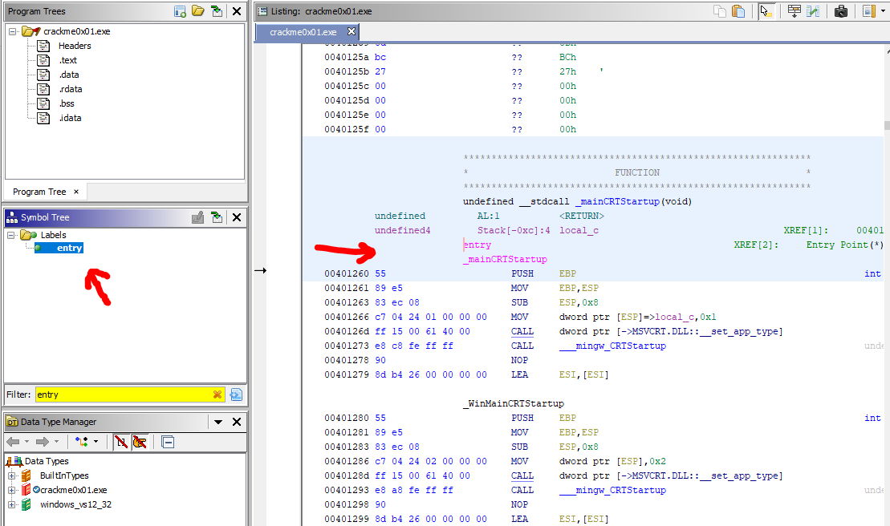
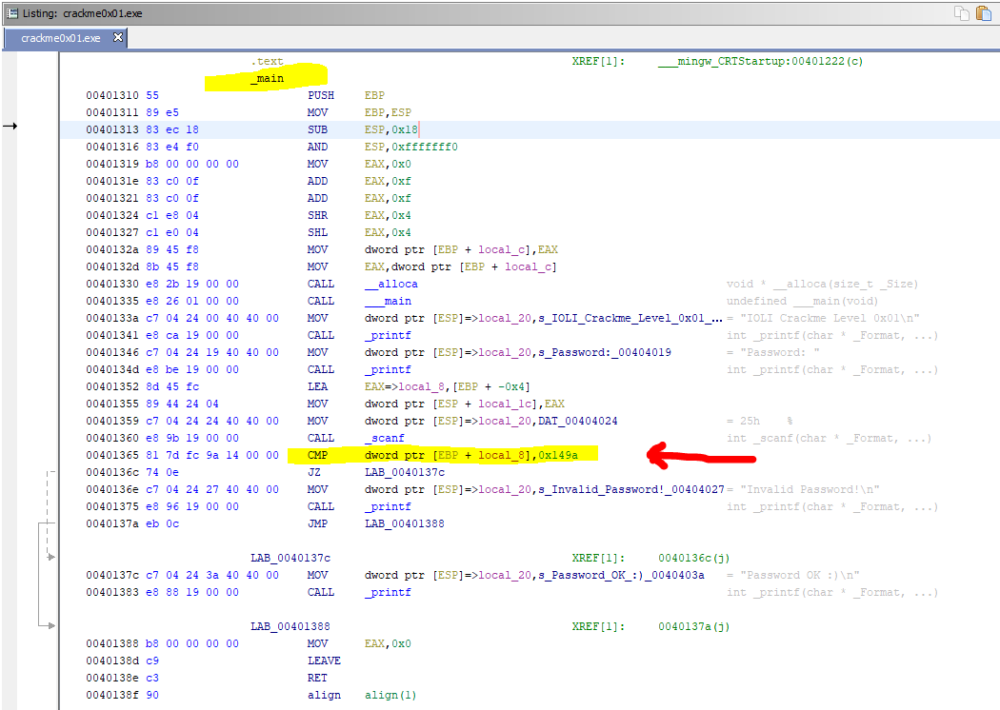
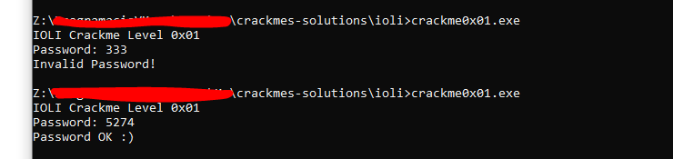

# [IOLI crackme0x01](crackme0x01.exe) 

## Crackme writeup by [@310hkc41b](https://twitter.com/310hkc41b) https://twitter.com/310hkc41b
#### Date: 06/abr/2020 

You can download **crackme0x01.exe** from this [link](crackme0x01.exe). 

This case is very similar to the previous one. 

To analyze this file also I have used only static analysis with **Ghidra**.

## Ghidra analysis

The first step is to find the entry point of the executable. Although in the previous example we have gone directly to the **main()** function, it could be the case that it did not exist (in these examples it does), and it may be interesting to see the entry point first.

 

Following the calls from this entry point we will see that in the end we reach **main()**.

As in the previous case, the key here is in the **CMP** where the input password is compared with a value. Unlike the previous level where it was compared to a string, here it is compared to a numeric value, represented in hexadecimal in the disassembly.

 

The hexadecimal value **0x149a** corresponds to the decimal value **5274** which is the password we are looking for.

Let's see if this is true ...

# That's all folks!

