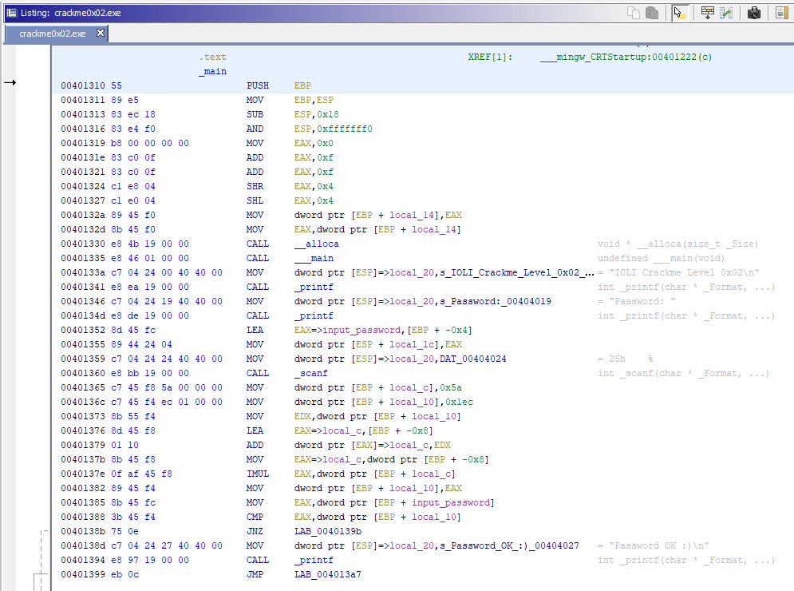
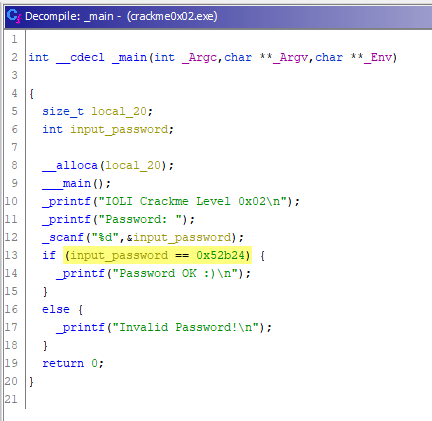
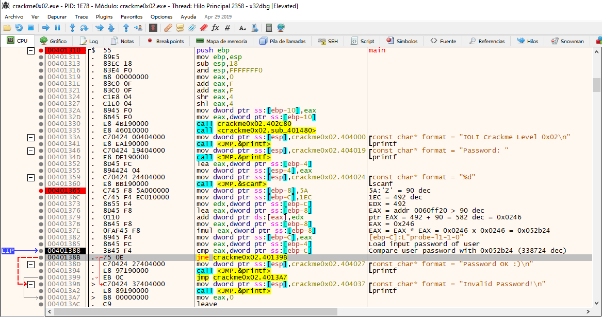
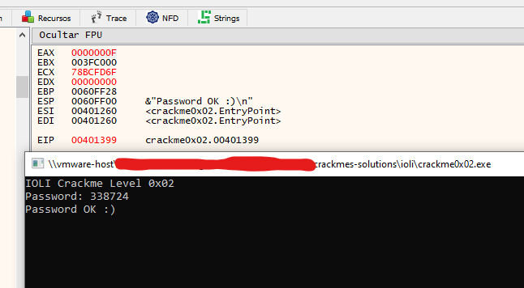

# [IOLI crackme0x02](crackme0x02.exe) 

## Crackme writeup by [@310hkc41b](https://twitter.com/310hkc41b) https://twitter.com/310hkc41b
#### Date: 07/abr/2020 

You can download **crackme0x02.exe** from this [link](crackme0x02.exe). 

To analyze this crackme I will use static analysis with **Ghidra** and dynamic with **x64dbg** to be able to follow up on the operations and values in memory.

## Ghidra analysis

In this case we see that the password is not so easily visible, because after asking for the password, different operations are performed with memory values to obtain the final value with which the final comparison is made.

A sum is made with the values **0x5a** and **0x1ec** and then multiplied by it to arrive at the password we need.

 

Although it is true that if we help ourselves with the decompiler, it simplifies all these calculations, leaving us the evidence of the final value sought, which is **0x52b24** = **338724 dec**.

 

However, we will also do the dynamic analysis to see how we get to this value.

## x64dbg analysis

And here we have the dynamic analysis of this process. Let's see what it does.

 

After entering the user password, a series of operations are performed with some values.

Values **0x5A** (90 dec) and **0x1EC** (492 dec) are first stored on the stack. These values are added together, obtaining the value **0x246** (582 dec). Then this value is multiplied by it, which amounts to squaring it, and we obtain the value **0x52b24** (338724 dec).

This last value is the one that is compared with the password entered by the user, so we can conclude that the password we are looking for is **338724**.

 

# That's all folks!

