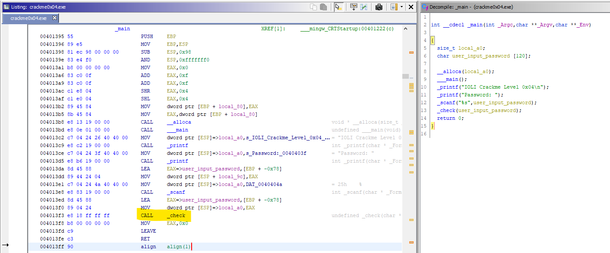
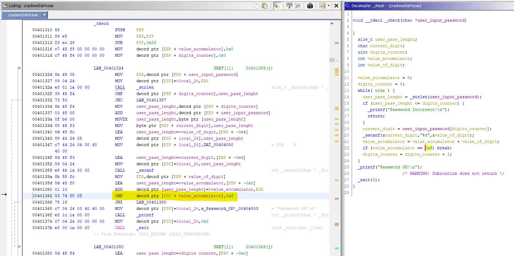
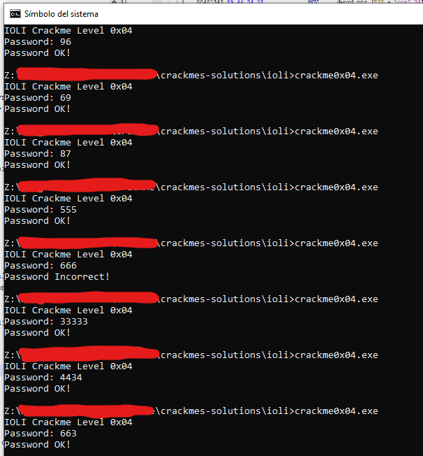

# [IOLI crackme0x04](crackme0x04.exe) 

## Crackme writeup by [@310hkc41b](https://twitter.com/310hkc41b) https://twitter.com/310hkc41b
#### Date: 07/abr/2020 

You can download **crackme0x04.exe** from this [link](crackme0x04.exe). 

To solve this cackme we will only use static analysis.

## Ghidra analysis

Here we see that the **_main()** function, after asking us for the password, calls another **_check()** function to check it. 

 

Well, let's see what this **_check()** function does.

 

Here we can see that the function what it does is to add the numerical values of each digit until reaching the value **0xF**, that is, **15 dec**. Any other combination will give wrong password.

Thus, some valid password combinations can be: 87, 96, 555, 663, 4434, 33333, etc. Any combination that the sum of its digits of the value 15.

Let's see ...

 

As we can see, in this case we will not need to do any dynamic analysis.

# That's all folks!

