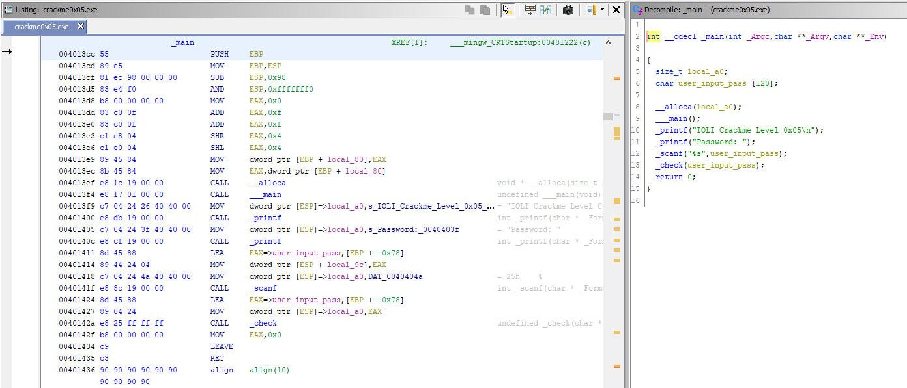
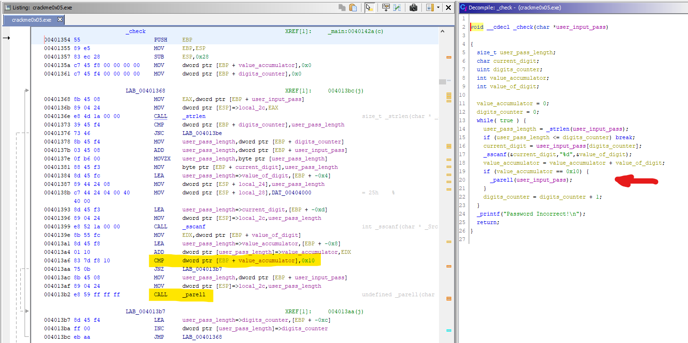
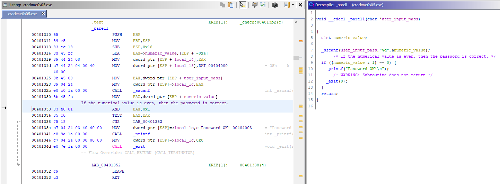
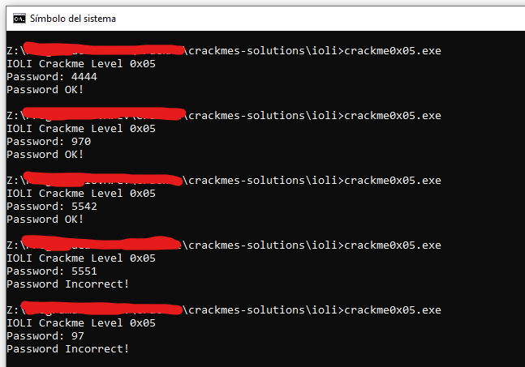

# [IOLI crackme0x05](crackme0x05.exe) 

## Crackme writeup by [@H0l3Bl4ck](https://twitter.com/H0l3Bl4ck) https://twitter.com/H0l3Bl4ck
#### Date: 07/abr/2020 

You can download **crackme0x05.exe** from this [link](crackme0x05.exe). 

To solve this cackme we will only use static analysis.

## Ghidra analysis

Initially the **_main()** function of this crackme is practically the same as the previous one. After asking us for the password, calls to **_check()** function to check it. 

 

But it can't be the same. Some difference will make, if not make no sense. Let's see what the **_check()** function does ...

 

Well, here we can see 2 changes.

The first is that the sum of the digits now has to be **0x10**, that is, **16 decimal**.

When this sum is fulfilled, another function **_parell()** is called that makes a new check on the entered password. Let's see ...

 

Here we see that it performs a binary AND operation with the value 1. This is done to find out if the number is odd or even. If the result is 0, it means that the number is even and then the password is correct.

So we have that the sum of the digits must be 16 and also the number itself will be even.

Some examples:

	4444 : ok
	970  : ok
	5542 : ok
	
	5551 : invalid
	97   : invalid
	

Let's see ...

 

# That's all folks!

