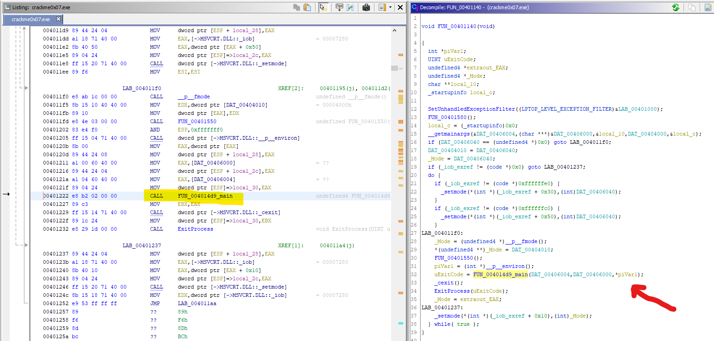
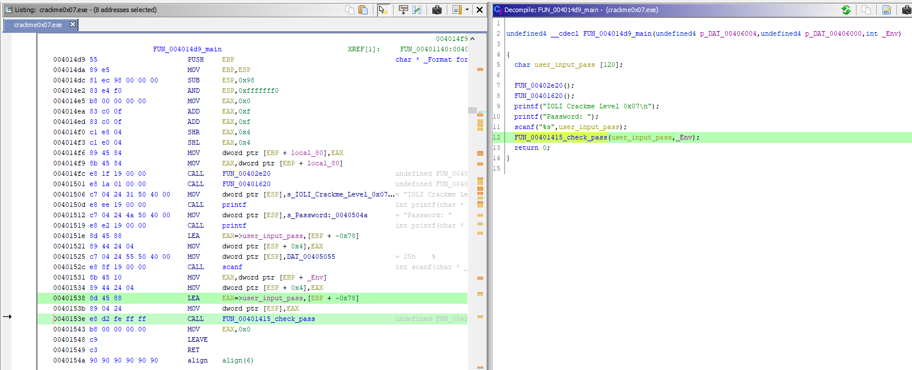
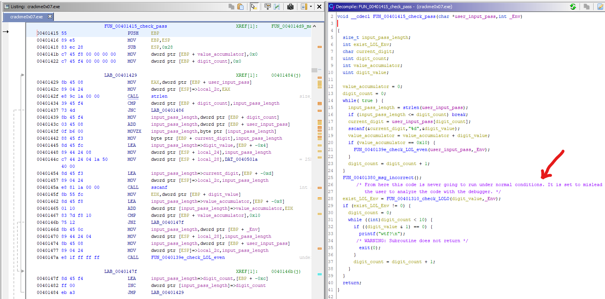
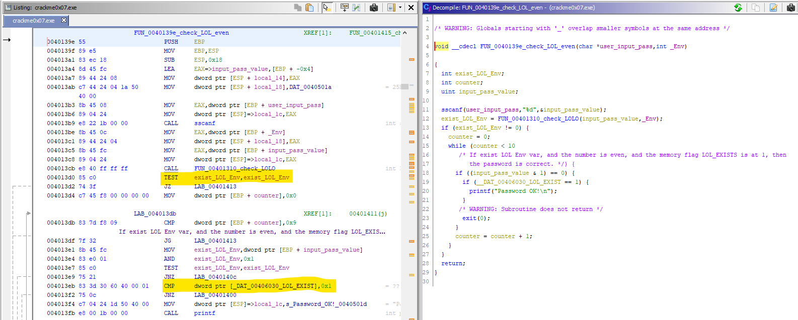
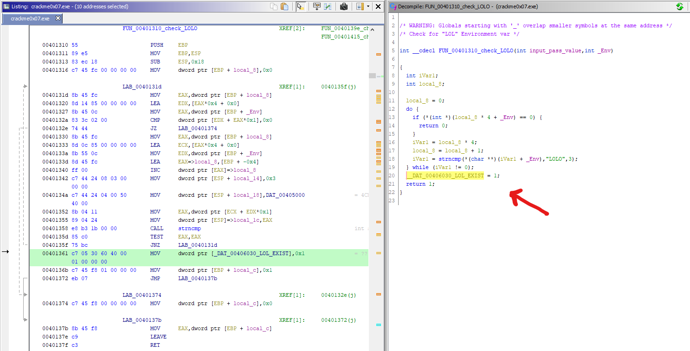
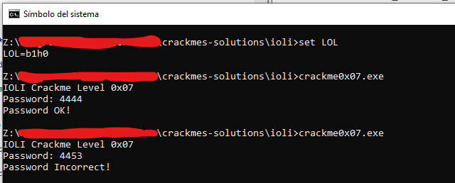

# [IOLI crackme0x07](crackme0x07.exe) 

## Crackme writeup by [@H0l3Bl4ck](https://twitter.com/H0l3Bl4ck) https://twitter.com/H0l3Bl4ck
#### Date: 08/abr/2020 

You can download **crackme0x07.exe** from this [link](crackme0x07.exe). 

To solve this cackme we will only use static analysis.

## Ghidra analysis

In this case, we can verify that there is no **_main()** function, so we proceed to search for the entry point by looking in the Ghidra symbols for the word **"entry"**.

 

Here you can see that the **FUN_00401140()** function is called and if we access it we will see that different parameters are set such as arguments, environment, access mode, etc., and finally a call to the **FUN_004014d9()** function that I will rename as **FUN_004014d9_main()** because it is the true **main()** of the program.

 

Let's check if the **FUN_004014d9_main()** function is the true **main()**.

 

Here we can see the usual structure of the other crackmes where the welcome message is displayed, it asks for the password and then calls the function to check this password.

Also note that this function receives a parameter that refers to the environment variables, so the environment variable check that already existed in the previous crackme is probably maintained.

After accessing the **FUN_00401415_check_pass()** function, the next step is to analyze the code and gradually replace the names of the variables with more understandable names to go deeper into the different parts of the code.

Once the thread of the different parts is understood, we do the same with the functions that are called.

 

Here we can find the same checks as before, that the sum of the digits is **0x10** (that is, **16 dec**), and then it calls the function that checks the environment variable **LOL** and that the value of the entered number is even. We will see this in detail below.

But before, it should be mentioned that under all this there is a code that will never be executed, unless you try to manipulate the results through the debugger. This code is never going to run under normal conditions. It is set to mislead the user to analyze the code with the debugger.

Let's now look at the **FUN_0040139e_check_LOL_even** function

 

Here we can see that the function **FUN_00401310_check_LOL()** is called and then it checks if the number is **even**.

But below we see a second check with another flag in memory that we call **__DAT_00406030_LOL_EXIST** in which it checks if it has the value **1**. It is actually a double check, since the same previous function already returns 1 or 0 if the **LOL** variable exists.

This is only to prevent changes while the program is being debugged and to give more work to the person who analyzes it.

If we look at the **FUN_00401310_check_LOLO()** function, we can see how this flag is set for double checking.

 

In summary, we can affirm that the conditions are the same as those of the previous crackme, only that more controls and code are included to mislead the user to carry out the analysis.

 

# That's all folks!

