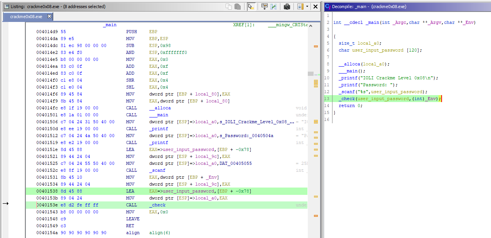
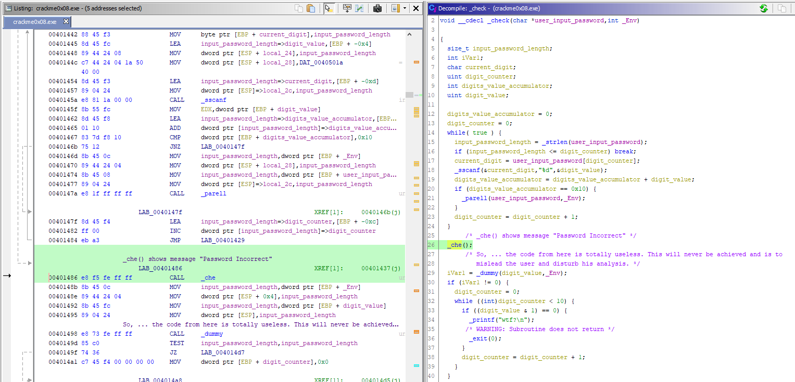
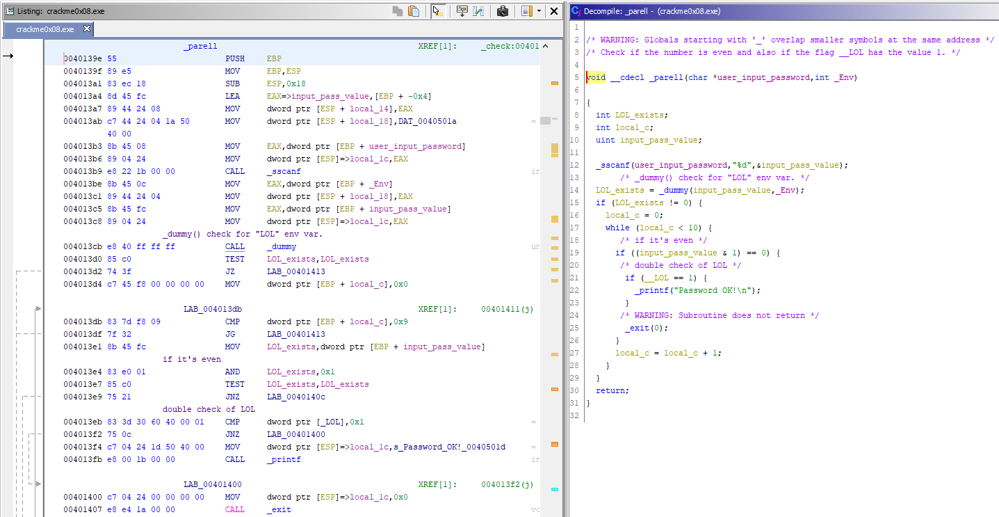
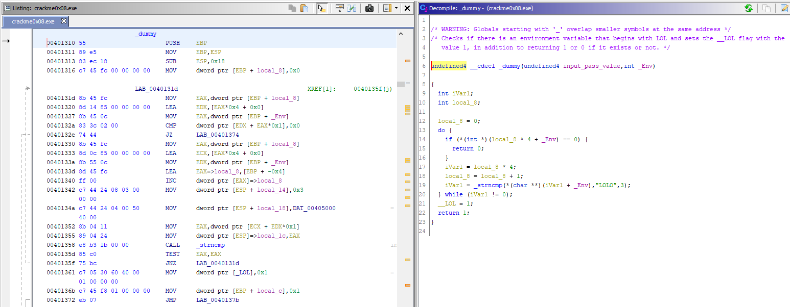
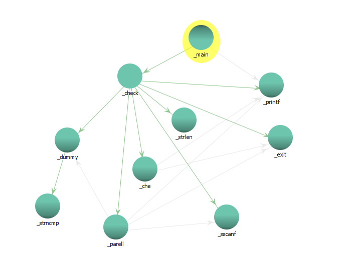
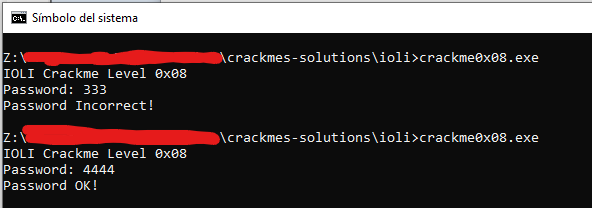

# [IOLI crackme0x08](crackme0x08.exe) 

## Crackme writeup by [@310hkc41b](https://twitter.com/310hkc41b) https://twitter.com/310hkc41b
#### Date: 08/abr/2020 

You can download **crackme0x08.exe** from this [link](crackme0x08.exe). 

To solve this cackme we will only use static analysis.

## Ghidra analysis

We have the expected **_main()** function again in this crackme. So far nothing new.

 

In this case we can see that almost all the program logic (except for a couple of more functions) is in the **_check()** function.

The same checks are made. That the sum of the digits is 0x10 (16 decimal) and if this first condition is met, the **_parell()** function is called, which does the rest of the checks.

If the above is not true, the **_che()** function is called, which is the one that displays the message of *"Incorrect Password"* and exits the program.

Just below this function, all the code that is there is totally useless because it will not be executed under normal conditions, unless the user manipulates the code while analyzing it in the debugger.

 

Let's see what it does in the **_parell()** function ...

 

First it calls the **_dummy()** function that checks if there is an environment variable that starts with **"LOL"** and returns the result on a variable, and also sets a flag to **1** (for a double check).

If this environment variable exists, then it enters a loop that will do 10 times (in case the conditions are not met, something useless and absurd), and then it checks if the number **is even** and then it checks the **LOL flag** and displays the message of **"Password OK"**.

 

And in the previous image you have the **_dummy()** function that checks the environment variables.

In fact this crackme does nothing different than the previous one in terms of checks, simply that the code is ordered differently to mislead the user, but the passwords that work are the same.

To put something different, i put the graph of calls between the different functions. 

It's not pretty? **:)**

 

And here we check that the same passwords work.

 

# That's all folks!

